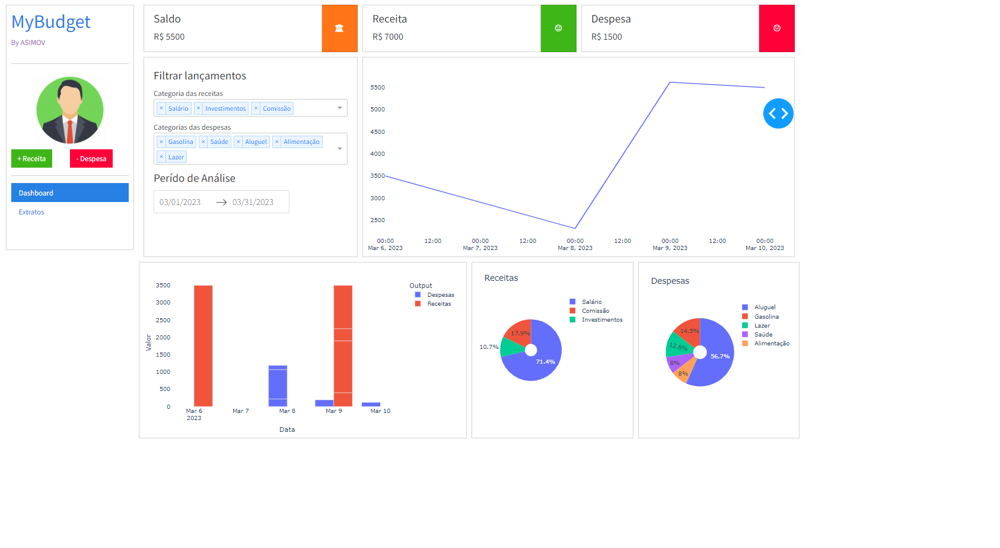

# MyBudget
This is "My Budget" from Asimov. An app to control incomes and spents.

> Dashboard de Finanças Pessoais com Python (Mar/2023) - from Asimov Academy

Projeto construído acompanhando a aula disponível no YouTube da Asimov Academy.

Existem ainda pontos de melhoria, mas o intuito era criar uma aplicação do zero, trabalhar os dados de entrada e saída e também apresentação visual de gráficos com os dados gerados.
Para facilitar, trabalhamos a arquitetura salvando os dados em CSV ao invés de usar um banco de dados. 

## Tecnologias

- Python
- Dash
- Pandas
- Dash Bootstrap Components
